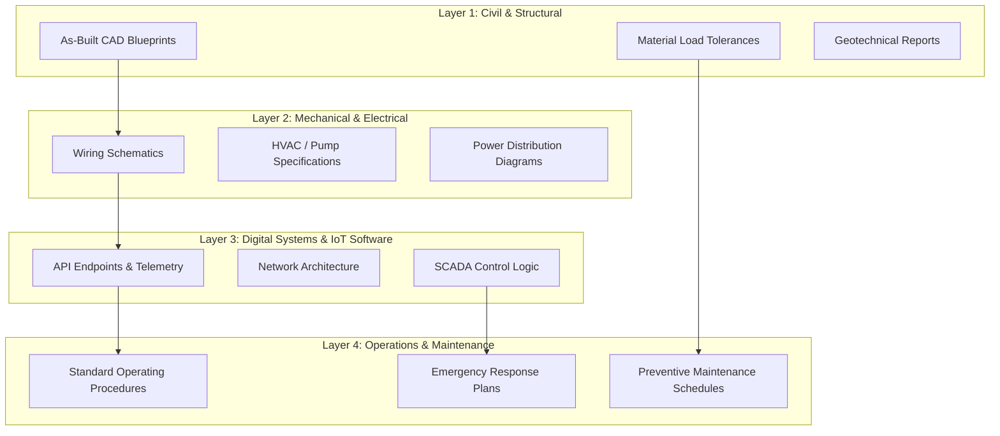

# Engineering Documentation Architecture

## 1. Architectural Overview

Modern infrastructure is no longer just physical; it is cyber-physical. A modern suspension bridge comprises thousands of tons of steel (Civil Engineering) monitored by hundreds of fiber-optic strain gauges and IoT sensors (Systems Engineering). 

The Engineering Documentation Architecture provides the framework for unifying these disparate engineering disciplines. It ensures that when a field technician accesses the documentation for an asset, they receive a holistic view of both its physical tolerances and its digital telemetry.

---

### Objectives
* **Unify Disparate Systems:** Bridge the gap between civil CAD models (e.g., AutoCAD, Revit) and software architecture documentation (e.g., API references, network topologies).
* **Enable Digital Twins:** Structure engineering documentation to support the creation and maintenance of live Digital Twins for Smart City infrastructure.
* **Streamline Handover:** Standardize the documentation requirements for contractors handing over newly constructed assets to the Operations team.

---

### The Cyber-Physical Documentation Stack

To prevent information siloing, all infrastructure assets are documented using a layered stack approach. Lower layers represent the physical reality, while upper layers represent digital control systems and operational procedures.

