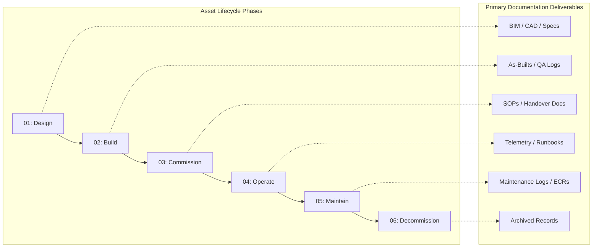

# Asset Lifecycle Documentation

## 1. Lifecycle Overview

Infrastructure assets within the Enterprise portfolio—ranging from state highway overpasses to smart city telemetry nodes—possess lifecycles spanning decades. 

The Asset Lifecycle Documentation framework ensures that as an asset evolves physically, its corresponding digital documentation evolves concurrently. By aligning our documentation deliverables with the physical engineering phases, we guarantee that field operators always have access to accurate, "As-Built" and "As-Maintained" data, mitigating severe safety and operational risks.

---

### Objectives
* **Information Continuity:** Prevent knowledge loss during the critical handover phase between external construction contractors and internal enterprise operations teams.
* **ISO 19650 Alignment:** Ensure all digital information delivery strictly adheres to international BIM (Building Information Modelling) and asset management standards.
* **Audit Readiness:** Maintain a continuous, version-controlled ledger of an asset's history from its initial design specs to its eventual safe decommissioning.

---

### The 6-Phase Physical-Digital Lifecycle

Documentation deliverables are strictly mapped to the physical maturity of the asset. The following matrix illustrates the flow of documentation requirements from Phase 1 through Phase 6.

