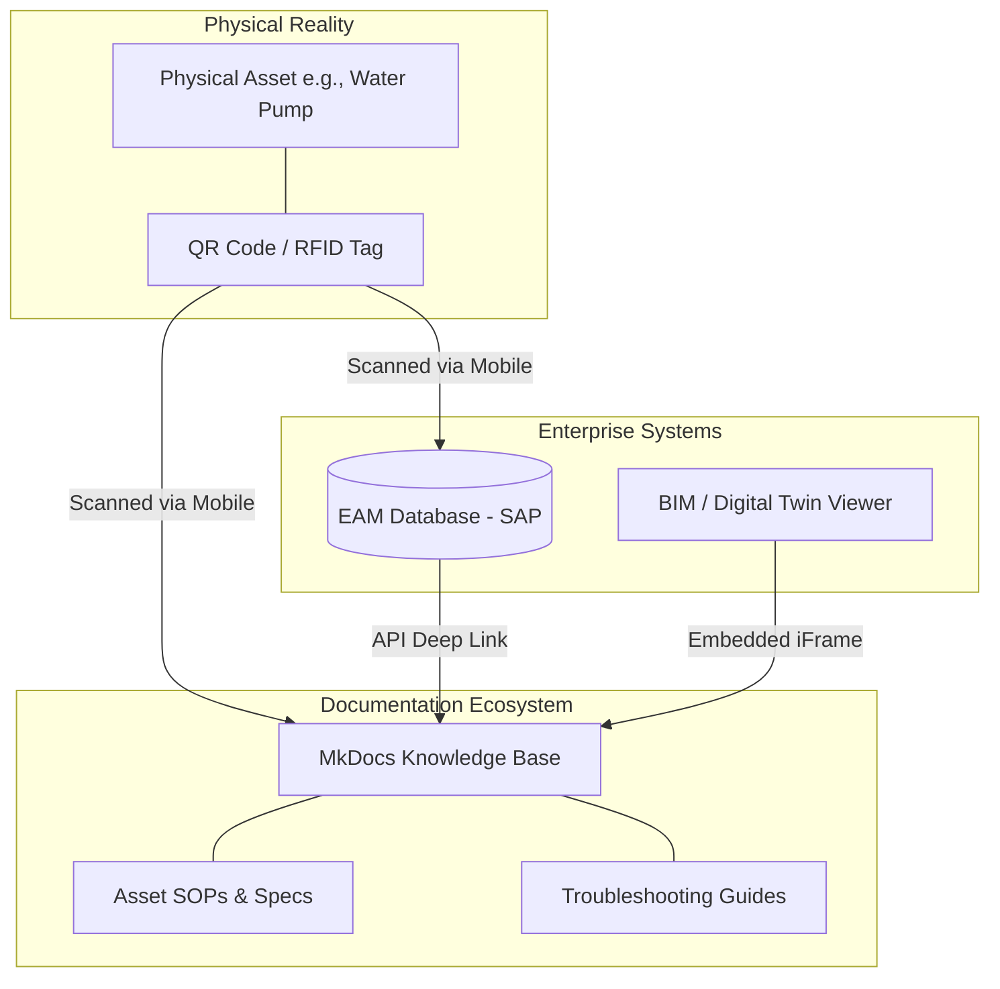

# Infrastructure Asset Documentation System

## 1. System Overview

The Infrastructure Asset Documentation System bridges the gap between the physical environment and the digital knowledge base.

With over 45,000 active assets across the enterprise—ranging from high-voltage transformers to automated rail signaling nodes—field technicians must be able to instantly pull the correct documentation while standing directly in front of the physical hardware. This system governs how physical assets are tagged, how documentation is mapped to Enterprise Asset Management (EAM) records, and how field access is delivered.

---

### Objectives

- **Zero-Friction Field Access:** Enable technicians to access Tier 1 safety and maintenance documentation within 3 seconds using mobile devices.
- **Maintain EAM Synchronization:** Ensure that the MkDocs documentation repository remains perfectly synchronized with the authoritative asset registry (e.g., SAP EAM / IBM Maximo).
- **Enable Digital Twin Maturity:** Provide the structured, machine-readable text layers required to overlay maintenance procedures onto 3D BIM models and Digital Twins.

---

### Physical-to-Digital Linkage Architecture

We utilize a tripartite system to link reality to documentation: Physical Tagging, the EAM Database, and the MkDocs Knowledge Base.

