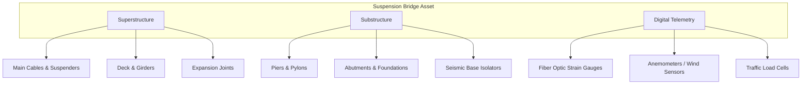

# Bridge Maintenance Documentation

## 1. Asset Overview

The Bridge Maintenance Documentation module serves as the central operational hub for all Tier 1 structural assets within the highway network. 

Given New Zealand's unique topographical and geological profile, our bridge assets are subjected to high seismic loads, extreme wind sheer, and corrosive marine environments. This documentation strictly governs the inspection cadences, structural load tolerances, and emergency response procedures required to maintain operational safety and structural integrity.

---

### Structural Component Taxonomy

To ensure standardized reporting during maintenance inspections, all bridge components are classified according to the following cyber-physical taxonomy:

