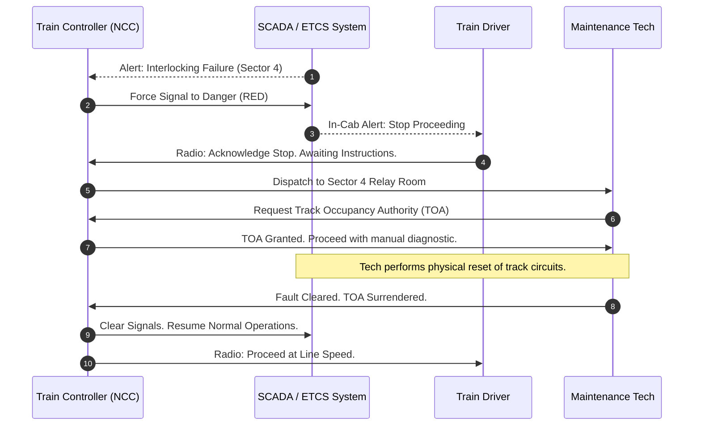

# Rail Operations Documentation

## 1. Network Overview

The Rail Operations Documentation module governs the safe, efficient, and compliant operation of the enterprise passenger and freight rail network.

Rail infrastructure is a highly integrated cyber-physical system. Physical assets (tracks, rolling stock, points) are entirely dependent on digital control systems (SCADA, European Train Control System - ETCS). This documentation provides the Single Source of Truth (SSoT) for the Network Control Centre (NCC), Train Drivers, and Track Maintenance Technicians.

---

### Critical Safety Protocols

The foundation of rail safety is the strict separation of trains and track workers. All procedures in this section are legally binding under the National Rail Safety Act.

#### Track Occupancy Authority (TOA)

No maintenance technician may enter the rail corridor without a formally issued TOA from the Network Control Centre.

1. **Request:** Technician submits a digital TOA request via the Enterprise Field App, specifying the exact track kilometer pegs (e.g., KM 14.5 to 16.2).
2. **Isolation:** The Train Controller digitally locks the specified sector in the SCADA system, forcing all approaching signals to **DANGER (RED)**.
3. **Issuance:** A unique, time-bound alphanumeric TOA code is transmitted to the technician.
4. **Surrender:** Upon completion of work, the technician must physically clear the track and surrender the TOA code via the app before the Train Controller can unlock the sector.

---

### Standard Operating Procedure: Signal Failure Response

**Context:** This sequence must be followed immediately upon the detection of an interlocking or signal failure on the mainline network.

**Procedure Sequence:**

