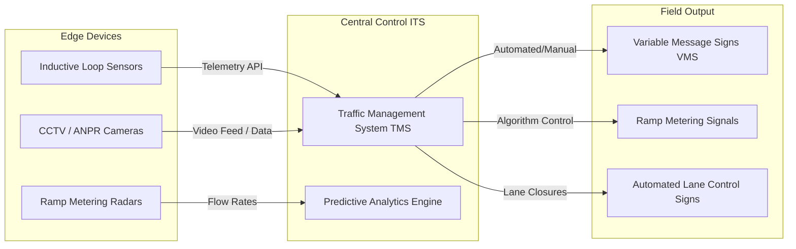

# Traffic Management Documentation

## 1. Network Overview

The Traffic Management Documentation module serves as the primary operational blueprint for the Enterprise Intelligent Transport System (ITS) network. 

Modern highway corridors are managed as dynamic, data-driven environments. This documentation governs the automated and manual interventions utilized by the Transport Operations Centre (TOC) to optimize traffic flow, reduce congestion, and manage incident responses across Smart Motorway networks. All procedures align with national ITS design standards and data privacy regulations regarding ANPR (Automatic Number Plate Recognition).

---

### Intelligent Transport System (ITS) Architecture

Traffic management requires the seamless integration of Edge Devices (sensors), Central Control systems, and Field Outputs. The following diagram maps the cyber-physical data flow that this documentation governs.

