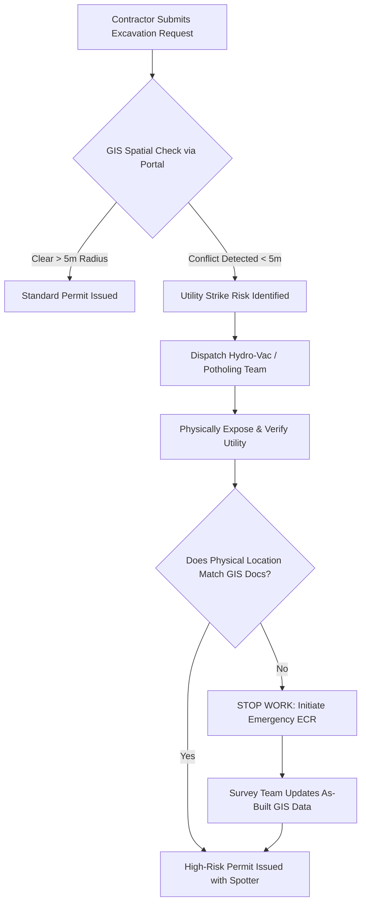

# Utilities Documentation Framework

## 1. Network Overview

The Utilities Documentation Framework governs the mapping, operation, and maintenance of all sub-surface and overhead utility networks integrated within our civil infrastructure footprint. 

Unlike a visible bridge or highway, underground utilities (high-voltage power, high-pressure gas, and fiber optics) represent an invisible, high-consequence risk profile. This documentation relies heavily on the integration of Geographic Information Systems (GIS) with our standard text-based operating procedures to ensure absolute spatial awareness for all field crews.

---

### GIS (Geographic Information System) Integration

Text-based documentation alone is insufficient for underground assets. All utility documentation must be spatially aware.

1. **The Spatial SSoT:** The Enterprise GIS Portal (e.g., Esri ArcGIS) serves as the Single Source of Truth for the *location* of utilities.
2. **Deep-Linking:** MkDocs operational manuals must dynamically link to the GIS portal using specific geospatial coordinates (Latitude/Longitude or NZTM2000 projections).
3. **As-Built Tolerance:** All underground "As-Built" documentation submitted by contractors must be accurate to within $\pm 100mm$ ($0.1m$) using survey-grade RTK GPS before it is accepted into the Enterprise repository.

---

### Critical Safety Workflow: Strike Prevention (Permit to Dig)

The most severe risk in utility operations is a "Service Strike" during civil excavation. No mechanical excavation may occur on enterprise property without following the documented Permit to Dig workflow.

