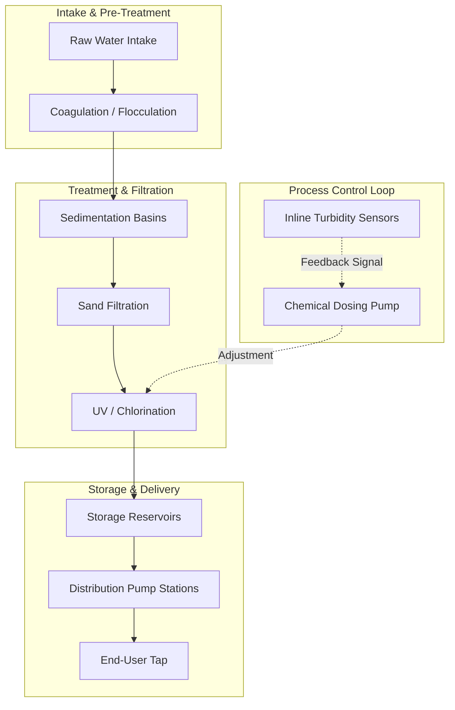

# Water Infrastructure Documentation

## 1. Network Overview

The Water Infrastructure Documentation module governs the operational protocols for our enterprise water treatment and distribution network. 

Water infrastructure is a high-consequence system. Unlike road or rail, where a documentation error might lead to a structural failure or delay, a failure in water process control documentation poses a direct threat to public health. Consequently, all procedures in this domain are subject to the highest level of regulatory scrutiny, requiring strict alignment with national health standards and environmental compliance protocols.

---

### Process Control Architecture

Water quality is managed through continuous SCADA monitoring of chemical dosing, flow rates, and turbidity. The following flowchart represents the core process control loop managed by the central SCADA system.

