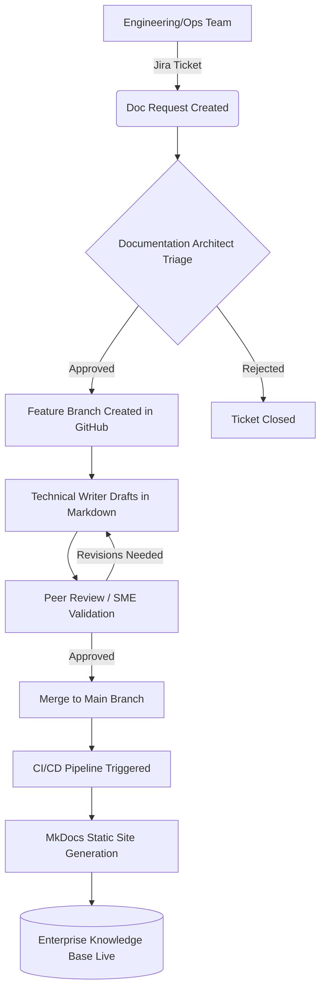

# Smart Infrastructure & Civil Engineering Documentation Program

## 1. Executive Summary

Welcome to the central Knowledge Management and Documentation Governance portal for the Enterprise Infrastructure Operations Division.

This program serves as the Single Source of Truth (SSoT) for a multibillion-dollar asset portfolio encompassing Smart Cities, Transportation Networks, Rail Systems, Bridges, Tunnels, Highways, Utilities, Water Infrastructure, Energy Grids, and Traffic Management Systems.

Designed and governed by the Senior Technical Documentation Architecture team, this framework ensures that all engineering, operations, maintenance, and compliance documentation adheres to ISO 19650 information management standards and robust Docs-as-Code methodologies.

---

### Objectives

- **Centralize Knowledge:** Eradicate information silos by unifying engineering diagrams, Standard Operating Procedures (SOPs), and regulatory compliance data into a strictly version-controlled, searchable Markdown/MkDocs ecosystem.
- **Accelerate Mean Time to Resolution (MTTR):** Provide field operators and maintenance engineers with immediate, mobile-responsive access to troubleshooting and emergency response manuals.
- **Ensure Regulatory Compliance:** Maintain rigorous audit trails for safety protocols, environmental regulations, and critical infrastructure risk assessments required by New Zealand government and civic authorities.
- **Standardize Content Delivery:** Enforce strict metadata, taxonomy, and stylistic standards across all internal and external-facing technical documentation.

### Scope

This documentation program governs the entire content lifecycle—from initial engineering asset design through operational maintenance and eventual decommissioning—for the following core domains:

1.  Smart Cities & IoT Infrastructure
2.  Highways, Bridges, and Tunnels
3.  Rail Systems and Transportation Networks
4.  Water, Energy, and Utility Grids
5.  Traffic Management and Automated Signaling Systems

### Stakeholders & RACI Matrix

Effective governance requires clear ownership. The following matrix outlines the high-level responsibilities for the documentation lifecycle.

| Role                                  | Strategy & Architecture | Content Creation | Technical Review | Final Approval |
| :------------------------------------ | :---------------------: | :--------------: | :--------------: | :------------: |
| **Principal Documentation Architect** |         **A/R**         |        C         |        I         |     **A**      |
| **Lead Civil/Systems Engineers**      |            C            |      **R**       |      **A**       |       I        |
| **Operations & Maintenance Leads**    |            C            |        R         |      **R**       |       I        |
| **Health, Safety & Quality (HSQ)**    |            I            |        C         |      **R**       |     **A**      |
| **Infrastructure Project Managers**   |            I            |        I         |        C         |     **R**      |

_(R = Responsible, A = Accountable, C = Consulted, I = Informed)_

---

### Enterprise Docs-as-Code Workflow

To maintain agility and integration with engineering teams, this documentation program utilizes a strict CI/CD (Continuous Integration/Continuous Deployment) pipeline.

