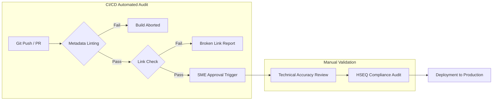

# Documentation Quality Audit Framework

## 1. Quality Philosophy

Enterprise infrastructure documentation is a mission-critical asset. Like the physical infrastructure it governs, it requires a rigorous, scheduled inspection regime. This Audit Framework defines the metrics, automated testing protocols, and annual review cycles required to keep the knowledge base accurate, secure, and compliant with national safety regulations.

---

### Key Performance Indicators (KPIs)

We measure the health of the documentation repository using four primary metrics. These are tracked via automated dashboards linked to our Git activity.

| Metric | Definition | Target Goal |
| :--- | :--- | :--- |
| **Docs-to-Asset Sync** | % of documents successfully linked to an active, non-archived EAM asset ID. | > 99.5% |
| **Mean Time to Correct (MTTC)** | Average time between an SME identifying an error and the PR being merged. | < 48 Hours |
| **Orphaned Content Rate** | % of documents missing a valid `author` metadata field. | 0% |
| **SME Review Latency** | Time taken for SMEs to provide technical sign-off on PRs. | < 5 Days |

---

### Automated Quality Gates

Quality is not verified after publication; it is verified *before* every single commit.

