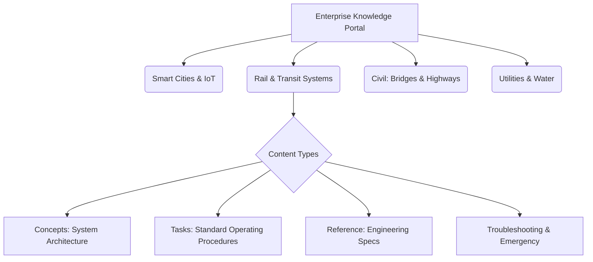

# Information Architecture Blueprint

## 1. Architectural Overview

The Information Architecture (IA) Blueprint defines the structural design of the Enterprise Infrastructure Knowledge Base. It dictates how information is organized, categorized, and interlinked across all engineering and operational domains.

In an infrastructure environment comprising tens of thousands of assets, a flat file structure is unsustainable. This blueprint mandates a highly structured, scalable hierarchy that separates content by **Domain**, **Asset Lifecycle Phase**, and **Information Type**.

---

### Objectives

- **Maximize Findability:** Ensure users can locate precise technical specifications or emergency procedures within a maximum of three clicks or a single search query.
- **Enable Single-Sourcing:** Structure content so that master engineering specifications can be embedded (reused) across multiple operational manuals without duplicating text.
- **Topic-Based Authoring:** Transition from monolithic, 500-page PDF manuals to modular, self-contained Markdown topics (Concept, Task, Reference).
- **Future-Proofing:** Design a directory and metadata structure scalable enough to accommodate future acquisitions or new smart city technology integrations.

---

### Enterprise Domain Ontology

The root architecture is divided into top-level engineering and operational domains. Each domain acts as a distinct knowledge silo at the repository level but is seamlessly unified through the MkDocs search index.

