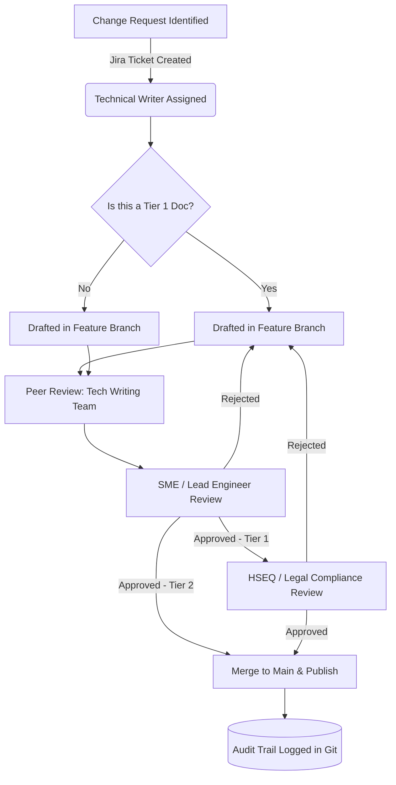

# Enterprise Documentation Governance Framework

## 1. Governance Overview

The Enterprise Documentation Governance Framework establishes the rules, roles, and review cycles required to maintain the integrity of our infrastructure knowledge base.

In a highly regulated engineering environment, undocumented changes or outdated procedures pose severe safety and financial risks. This framework ensures that all documentation—from smart city API endpoints to physical bridge maintenance manuals—is treated as a controlled, auditable asset subject to strict quality assurance and lifecycle management.

---

### Objectives

- **Ensure Compliance:** Maintain continuous alignment with ISO 19650, ISO 9001, and regional statutory requirements (e.g., New Zealand Building Code, HSWA).
- **Enforce Accountability:** Clearly delineate ownership for content creation, technical validation, and periodic review.
- **Control Change:** Implement a standardized Engineering Change Request (ECR) process for documentation updates.
- **Mitigate Risk:** Prevent the publication of unauthorized or technically inaccurate operational procedures.

### Scope

This governance framework applies to all Tier 1 (Critical Safety & Compliance) and Tier 2 (Operational & Engineering) documentation housed within the Enterprise Knowledge Base. It governs the entire lifecycle from initial drafting via Jira ticketing to eventual archiving and deprecation.

---

### Governing Bodies & Committees

#### The Enterprise Documentation Control Board (EDCB)

The EDCB is the ultimate authority on documentation standards and infrastructure taxonomy.

- **Members:** Principal Documentation Architect (Chair), Lead Systems Engineer, HSEQ Director, Operations Manager.
- **Cadence:** Meets monthly.
- **Mandate:** Approve sweeping taxonomy changes, resolve cross-departmental documentation conflicts, and review quarterly documentation ROI and compliance metrics.

---

### Documentation Tiering Strategy

Not all documentation requires the same level of rigorous oversight. We employ a three-tier governance model:

| Tier                      | Description                                                                            | Review Cadence         | Approval Authority   |
| :------------------------ | :------------------------------------------------------------------------------------- | :--------------------- | :------------------- |
| **Tier 1: Critical**      | Emergency Response, Safety Protocols, Regulatory Audits, Structural Engineering Specs. | Bi-Annually (6 Months) | EDCB + HSEQ Director |
| **Tier 2: Operational**   | Standard Operating Procedures (SOPs), Maintenance Manuals, System Architecture.        | Annually (12 Months)   | Lead Engineer / SME  |
| **Tier 3: Informational** | Internal team wikis, meeting notes, project drafts.                                    | As Needed              | Content Creator      |

---

### The Governance Workflow (Engineering Change Process)

To enforce strict Docs-as-Code governance, no direct commits to the `main` branch are permitted. All changes must pass through a pull request (PR) and SME review pipeline.

