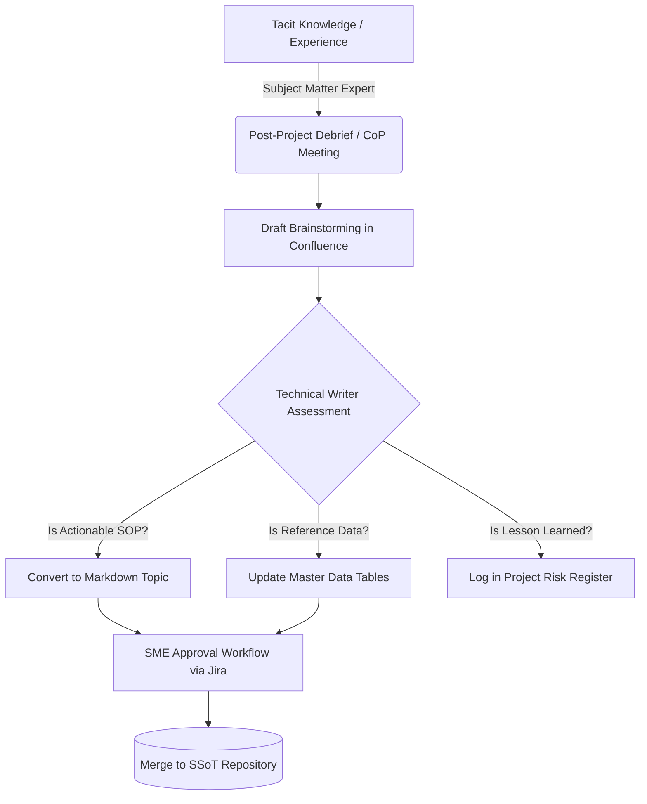

# Knowledge Management Program

## 1. Program Overview

The Knowledge Management (KM) Program is the strategic engine that drives continuous learning across the Enterprise Infrastructure Operations Division.

While the Documentation Governance Framework dictates _how_ we store information, the KM Program defines _how we capture it_. In the infrastructure sector, retiring engineers take decades of domain expertise with them. This program ensures that tacit knowledge—lessons learned from complex bridge deployments, smart grid integrations, and tunneling projects—is systematically captured, validated, and converted into explicit, searchable assets.

---

### Objectives

- **Prevent Knowledge Attrition:** Systematize the extraction of domain expertise from senior engineers prior to retirement or reassignment.
- **Accelerate Onboarding:** Reduce the ramp-up time for new infrastructure project managers and field technicians by 30% through curated learning paths.
- **Eliminate Redundant Problem-Solving:** Create a centralized "Lessons Learned" repository to ensure mistakes made on past civil projects are not repeated.
- **Foster Communities of Practice (CoP):** Establish cross-functional forums where engineers can share emerging best practices regarding IoT traffic management and sustainable water infrastructure.

### Scope

The KM Program encompasses the lifecycle of knowledge creation, sharing, and application across all enterprise operational units. It applies to:

- Post-Incident Reviews (PIR) and Root Cause Analyses (RCA).
- Agile Sprint Retrospectives for Smart City software deployments.
- End-of-Phase project debriefs for long-term civil engineering projects.

---

### The Knowledge Capture Workflow

Converting undocumented expertise into formal documentation requires a frictionless process. We utilize a "Draft in Wiki, Publish as Code" pipeline. Confluence is used for messy, collaborative brainstorming, which Technical Writers then refine and commit to the MkDocs repository.

