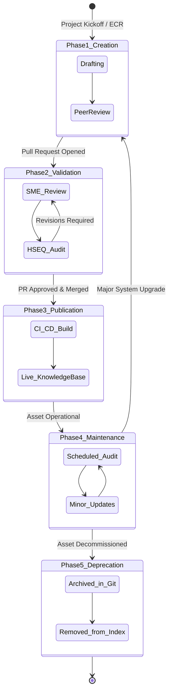

# Documentation Lifecycle Model

## 1. Lifecycle Overview

The Enterprise Documentation Lifecycle Model defines the standard progression of all technical content from initial conception to final deprecation.

Because our documentation directly governs the safe operation of physical infrastructure, it cannot exist in a static state. This lifecycle ensures that documentation evolves in lockstep with the physical assets it describes, maintaining strict alignment with ISO 19650 information delivery cycles.

---

### Objectives

- **Maintain Accuracy:** Ensure content is continuously validated against the current operational state of the infrastructure.
- **Prevent Clutter:** Establish strict archiving protocols so outdated procedures do not confuse field technicians.
- **Align with Engineering Phases:** Map documentation deliverables to specific milestones in civil and systems engineering projects.

---

### The 5-Phase Documentation Lifecycle

The following diagram illustrates the standard lifecycle for Tier 1 and Tier 2 documentation within our Docs-as-Code ecosystem.

