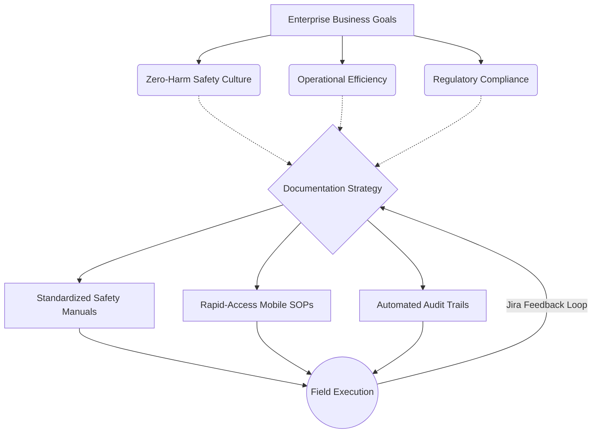

# Documentation Vision and Strategy

## Strategic Overview

The Documentation Vision and Strategy defines the overarching philosophy, core pillars, and long-term trajectory for the Enterprise Infrastructure Operations Division's knowledge ecosystem.

In a sector where asset lifecycles span 50 to 100 years, documentation is not merely an operational artifact; it is a critical organizational asset. Our vision is to transition documentation from a reactive, decentralized byproduct of engineering into a proactive, embedded, and highly governed strategic enabler.

---

### Core Vision Statement

> _"To deliver an uncompromising Single Source of Truth (SSoT) that empowers our engineering and operational teams to design, build, and maintain smart, safe, and resilient infrastructure. We will achieve this by treating documentation as code, embedding technical writers into the engineering lifecycle, and making critical knowledge instantly accessible at the point of need."_

---

### Strategic Pillars

Our 5-year documentation maturity roadmap is built upon four foundational pillars:

1. **Docs-as-Code Dominance:** Treating infrastructure documentation with the same rigor as software code. Utilizing Git for version control, Markdown for semantic structuring, and CI/CD pipelines for automated publishing and quality checks.
2. **Compliance & Safety by Design:** Structuring our content architecture to natively support rigorous regulatory frameworks, including ISO 19650 (Information Management using BIM) and the New Zealand Health and Safety at Work Act 2015 (HSWA).
3. **Frictionless Accessibility:** Ensuring that a maintenance technician on a remote bridge structure in adverse weather can access the exact troubleshooting procedure on a mobile device in under three clicks.
4. **Data-Driven Governance:** Shifting from qualitative guesswork to quantitative content health metrics. Utilizing analytics to measure search success, content freshness, and feedback loop closure rates.

---

### Strategy Alignment Model

The following model illustrates how our documentation strategy directly supports enterprise infrastructure goals.

